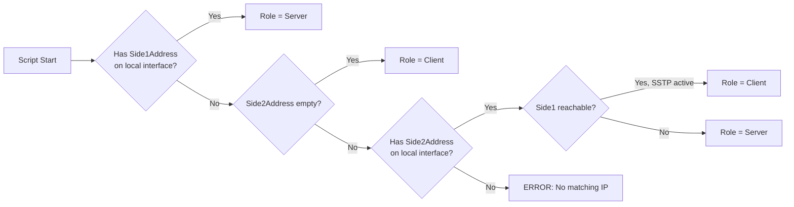
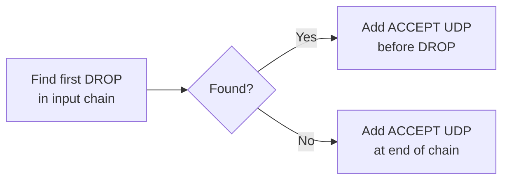

# Architecture

Technical design document for k2o-wg-p2p-connector.

## Design Goals

1. **Single script** — same file works on both routers
2. **Automatic role detection** — based on IP addresses
3. **Automatic key exchange** — no manual intervention required
4. **One adoption at a time** — server handles only one pending connection
5. **Clean removal** — all entities can be removed by tunnel ID
6. **Fallback to manual** — if automation fails, show instructions

## Role Detection Logic



## Configuration Structure

```routeros
# ═══════════════════════════════════════════════════════════════════
#  BASIC CONFIGURATION (required)
# ═══════════════════════════════════════════════════════════════════

:global p2pSide1Address "1.2.3.4"          # Public IP/FQDN of Side1
:global p2pSide2Address "5.6.7.8"          # Public IP of Side2 (empty if NAT)
:global p2pSstpPass "ChangeThisPassword!"  # Key exchange password

# ═══════════════════════════════════════════════════════════════════
#  MAIN CONFIGURATION (with defaults)
# ═══════════════════════════════════════════════════════════════════

:global p2pTunnelName "tunnel1"            # Short tunnel identifier
:global p2pSide1WgIP "10.200.0.1"          # Side1 WG IP
:global p2pSide2WgIP "10.200.0.2"          # Side2 WG IP
:global p2pWgNetmask "/30"                 # Network mask

# ═══════════════════════════════════════════════════════════════════
#  ADVANCED CONFIGURATION (optional)
# ═══════════════════════════════════════════════════════════════════

:global p2pWgPort 51820                    # WireGuard UDP port
:global p2pSstpPort 443                    # SSTP TCP port
:global p2pSstpUser "p2p-k2o-exchange"     # SSTP username
:global p2pTimeout 300                     # Timeout (seconds)
```

## Naming Convention

| Entity | Pattern | Example |
|--------|---------|---------|
| WG Interface | `wg-p2p-k2o-{name}-{id}` | `wg-p2p-k2o-office-20251206173000` |
| WG Peer | `wg-p2p-k2o-peer-{id}` | `wg-p2p-k2o-peer-20251206173000` |
| Remove script | `remove-p2p-k2o-{id}` | `remove-p2p-k2o-20251206173000` |
| Finalize script | `p2p-k2o-finalize` | (no ID, only one at a time) |
| Cancel script | `p2p-k2o-cancel` | (no ID, only one at a time) |
| PPP secret (temp) | `p2p-k2o-{id}` | `p2p-k2o-20251206173000` |
| PPP profile (temp) | `p2p-k2o-profile-{id}` | `p2p-k2o-profile-20251206173000` |
| Register script (temp) | `p2p-k2o-register-{id}` | `p2p-k2o-register-20251206173000` |

## Comment Marker

All created entities have this comment format:

```
Generated by k2o-wg-p2p-connector | k2o.cc | ID:20251206173000 | 06.12.2025 17:30:00
```

## Tunnel ID Format

```
YYYYMMDDHHMMSS
```

Example: `20251206173000` = 2025-12-06 17:30:00

- Generated on **server** at adoption start
- Synchronized to **client** during SSTP key exchange
- Used to identify all entities for removal

## Key Exchange Flow

```mermaid
sequenceDiagram
    participant S as Side1 (Server)
    participant C as Side2 (Client)

    rect rgb(200, 220, 255)
        Note over S: INITIALIZATION
        S->>S: Generate Tunnel ID
        S->>S: Create WG interface
        S->>S: Get public key
        S->>S: Start SSTP server
        S->>S: Create register script
    end

    S-->>S: Waiting for client (5 min)...

    rect rgb(220, 255, 220)
        Note over C: INITIALIZATION
        C->>C: Create WG interface
        C->>C: Get public key
    end

    rect rgb(255, 240, 200)
        Note over S,C: KEY EXCHANGE
        C->>S: Connect via SSTP
        C->>S: SSH: send client pubkey
        S->>C: Return: server pubkey + tunnel ID
    end

    rect rgb(255, 220, 220)
        Note over S: FINALIZATION
        S->>S: Add WG peer
        S->>S: Add firewall rule
        S->>S: Stop SSTP server
        S->>S: Cleanup temp entities
        S->>S: Generate remove script
    end

    rect rgb(255, 220, 220)
        Note over C: FINALIZATION
        C->>C: Disconnect SSTP
        C->>C: Add WG peer (with endpoint)
        C->>C: Rename interface with ID
        C->>C: Generate remove script
    end

    S<-->C: WireGuard tunnel active!
```

## Single Adoption Mechanism

Only one adoption process can be active on server at a time.

```routeros
# Global state variables (server only)
:global p2pAdoptionActive false
:global p2pAdoptionID ""
:global p2pAdoptionServerPubkey ""

# Check before starting new adoption
:if ($p2pAdoptionActive) do={
    :put "ERROR: Another adoption in progress (ID: $p2pAdoptionID)"
    :put "Run: /system script run p2p-k2o-cancel"
    :error "Adoption already active"
}

# Set active
:set p2pAdoptionActive true
:set p2pAdoptionID $tunnelID
:set p2pAdoptionServerPubkey $myPubkey

# Clear on completion/timeout/cancel
:set p2pAdoptionActive false
```

## Firewall Integration

Server automatically adds WireGuard accept rule before first drop:



```routeros
:local dropRules [/ip firewall filter find where chain="input" action~"drop|reject" !disabled]
:if ([:len $dropRules] > 0) do={
    :local firstDrop [:pick $dropRules 0]
    /ip firewall filter add \
        chain=input protocol=udp dst-port=$p2pWgPort \
        action=accept comment=$p2pComment place-before=$firstDrop
}
```

## Manual Fallback

If automatic key exchange fails:

### On Server

```
═══════════════════════════════════════════════════════════════════
  MANUAL KEY EXCHANGE
═══════════════════════════════════════════════════════════════════

  SERVER PUBLIC KEY:
  +ABC123...XYZ=

  Waiting for client public key...

  When you have client's key, run:
  :global p2pClientPubkey "+CLIENT_KEY_HERE="
  /system script run p2p-k2o-finalize
═══════════════════════════════════════════════════════════════════
```

### On Client

```
═══════════════════════════════════════════════════════════════════
  MANUAL KEY EXCHANGE
═══════════════════════════════════════════════════════════════════

  CLIENT PUBLIC KEY:
  +DEF456...ABC=

  1. Copy this key to SERVER router
  2. Get server's public key
  3. On THIS router run:
     :global p2pServerPubkey "+SERVER_KEY_HERE="
     /system script run p2p-k2o-finalize
═══════════════════════════════════════════════════════════════════
```

## Remove Script

Generated on both server and client:

```routeros
# remove-p2p-k2o-{id}
:local tunnelID "{id}"
:local marker "ID:$tunnelID"

:put "Removing P2P tunnel: $tunnelID"
:log warning "P2P-WG: Removing tunnel $tunnelID"

# Remove WG peers
:do { /interface wireguard peers remove [find where comment~$marker] } on-error={}

# Remove IP addresses
:do { /ip address remove [find where comment~$marker] } on-error={}

# Remove firewall rules
:do { /ip firewall filter remove [find where comment~$marker] } on-error={}

# Remove routes
:do { /ip route remove [find where comment~$marker] } on-error={}

# Remove WG interface
:do { /interface wireguard remove [find where comment~$marker] } on-error={}

# Remove this script
:do { /system script remove [find where comment~$marker] } on-error={}

:put "Tunnel $tunnelID removed!"
:log warning "P2P-WG: Tunnel $tunnelID removed"
```

## Error Handling

| Error | Server Action | Client Action |
|-------|--------------|---------------|
| Adoption already active | Show error, suggest cancel | N/A |
| SSTP connection failed | N/A | Show manual exchange |
| SSH execution failed | N/A | Show manual exchange |
| Key exchange timeout | Cleanup, show manual | Show manual exchange |
| WG interface creation failed | Fatal error | Fatal error |

## File Structure

```
k2o-wg-p2p-connector/
├── README.md              # English documentation
├── README.uk.md           # Ukrainian documentation
├── ARCHITECTURE.md        # This file
├── wg-p2p-connector.rsc   # Main script
├── LICENSE                # MIT License
└── .gitignore
```
