# k2o-wg-p2p-connector

[](README.uk.md)

Automated WireGuard P2P tunnel setup between two MikroTik RouterOS devices.

## Overview

This script automates the creation of a WireGuard point-to-point tunnel between two MikroTik routers. Run the same script on both devices — keys are exchanged automatically via a temporary SSTP connection.

## Features

- **One script for both sides** — same file runs on both routers
- **Automatic role detection** — determines server/client based on IP addresses
- **Automatic key exchange** — no manual copy-paste of public keys
- **Port conflict detection** — auto-finds available port if default is busy
- **Unique tunnel ID** — each tunnel gets a timestamp-based identifier
- **Easy removal** — auto-generated removal script for clean uninstall
- **Firewall integration** — automatically opens WireGuard port on server

## Quick Start

### 1. Download and configure

Download `wg-p2p-connector.rsc` and edit the configuration section:

```routeros
# ═══════════════════════════════════════════════════════════════════
#  BASIC CONFIGURATION (required)
# ═══════════════════════════════════════════════════════════════════

:global p2pSide1Address "1.2.3.4"          # Public IP of Side1 (server)
:global p2pSide2Address "5.6.7.8"          # Public IP of Side2 (or empty if behind NAT)
:global p2pSstpPass "ChangeThisPassword!"  # Key exchange password (same on both)
```

**Role detection:**
- If both IPs are public → first to run becomes server
- If Side2 is empty or behind NAT → Side1 is server, Side2 is client

### 2. Upload to both routers

Upload the configured script to both routers.

### 3. Run on Side1 (server) first

```routeros
/import wg-p2p-connector.rsc
```

### 4. Run on Side2 (client) within 5 minutes

```routeros
/import wg-p2p-connector.rsc
```

### 5. Done! Test connectivity

```routeros
/ping 10.200.0.1   # from Side2
/ping 10.200.0.2   # from Side1
```

## How It Works

```mermaid
flowchart TB
    subgraph INIT["1️⃣ Initialization"]
        direction LR
        S1["🖥️ SERVER<br/>Create WG interface<br/>Find free port<br/>Start SSTP server"]
        C1["💻 CLIENT<br/>Create WG interface<br/>Connect via SSTP"]
    end

    subgraph EXCHANGE["2️⃣ Key Exchange via SSH"]
        direction LR
        E1["Client sends pubkey<br/>━━━━━━━━━━━━━━━▶"]
        E2["◀━━━━━━━━━━━━━━━<br/>Server returns:<br/>• pubkey<br/>• tunnel ID<br/>• WG port"]
    end

    subgraph FINALIZE["3️⃣ Finalize"]
        direction LR
        F1["🖥️ SERVER<br/>Add client peer<br/>Add firewall rule<br/>Cleanup SSTP"]
        F2["💻 CLIENT<br/>Add server peer<br/>Set endpoint"]
    end

    subgraph RESULT["✅ Result"]
        R1["WireGuard P2P Tunnel Active!<br/>10.200.0.1 ◄━━ encrypted ━━► 10.200.0.2"]
    end

    INIT --> EXCHANGE --> FINALIZE --> RESULT
```

<details>
<summary>📊 Show diagram</summary>



</details>

## Configuration Reference

### Basic (required)

| Variable | Description | Example |
|----------|-------------|---------|
| `p2pSide1Address` | Public IP/FQDN of Side1 | `"vpn.example.com"` |
| `p2pSide2Address` | Public IP of Side2 (empty if NAT) | `"5.6.7.8"` or `""` |
| `p2pSstpPass` | Key exchange password | `"SecurePass123!"` |

### Main (with defaults)

| Variable | Default | Description |
|----------|---------|-------------|
| `p2pTunnelName` | `"tunnel1"` | Short tunnel identifier |
| `p2pSide1WgIP` | `"10.200.0.1"` | Side1 WireGuard IP |
| `p2pSide2WgIP` | `"10.200.0.2"` | Side2 WireGuard IP |
| `p2pWgNetmask` | `"/30"` | Network mask |

### Advanced (optional)

| Variable | Default | Description |
|----------|---------|-------------|
| `p2pWgPort` | `51820` | WireGuard UDP port (auto-increments if busy) |
| `p2pSstpPort` | `443` | SSTP TCP port for key exchange |
| `p2pSstpUser` | `"p2p-k2o-exchange"` | SSTP username |
| `p2pTimeout` | `300` | Server wait timeout (seconds) |

> **Note:** If `p2pWgPort` is already in use, the server automatically finds the next available port and communicates it to the client.

## Removal

To remove the tunnel, run on each router:

```routeros
/system script run remove-p2p-k2o-{ID}
```

**Safety feature:** You must run the removal script **3 times within 30 seconds** to confirm deletion. This prevents accidental tunnel removal.

```
==================================================
  REMOVAL CONFIRMATION REQUIRED
==================================================
  Tunnel ID: 20251209123456

  Run this script 2 more time(s)
  within 30 seconds to confirm removal.
==================================================
```

The removal script name is shown at the end of deployment.

## Routing Examples

The script creates point-to-point connectivity only. For routing additional networks, see [MikroTik WireGuard documentation](https://help.mikrotik.com/docs/display/ROS/WireGuard).

**Route client LAN (192.168.88.0/24) through tunnel (on server):**

```routeros
/ip route add dst-address=192.168.88.0/24 gateway=10.200.0.2
```

**Route all traffic through tunnel (on client):**

```routeros
/ip route add dst-address=0.0.0.0/0 gateway=10.200.0.1 distance=10
```

## Manual Key Exchange

If automatic exchange fails, the script will display instructions for manual key copy-paste.

For manual mode, set these globals on the client before running finalize:

```routeros
:global p2pServerPubkey "SERVER_PUBLIC_KEY"
:global p2pServerTunnelID "TUNNEL_ID"
:global p2pServerPort 51821   # only if server uses non-default port
/system script run p2p-k2o-finalize
```

## Requirements

- MikroTik RouterOS 7.x with WireGuard support
- Side1 must have public IP (or port forwarding for SSTP and WG ports)
- Side2 must be able to reach Side1 on SSTP port (443 by default)

## License

k2o Custom License — free to use, attribution required, no resale — see [LICENSE](LICENSE)

## Support the Project

If you find this useful:

- **GitHub**: Star this repo
- **PayPal**: [paypal.me/olekovin](https://paypal.me/olekovin)
- **Crypto**: See below

<details>
<summary>Crypto donations</summary>

- **BTC**: `bc1qxxxxxxxxxxxxxxxxxxxxxxxxxxxxxx`
- **ETH**: `0xXXXXXXXXXXXXXXXXXXXXXXXXXXXXXXXXXXXXXXXX`
- **USDT (TRC20)**: `TXxxxxxxxxxxxxxxxxxxxxxxxxxxxxxxxxxxx`

</details>

---

Made with help of AI by [@olekovin](https://t.me/olekovin) | [k2o.cc](https://k2o.cc)
