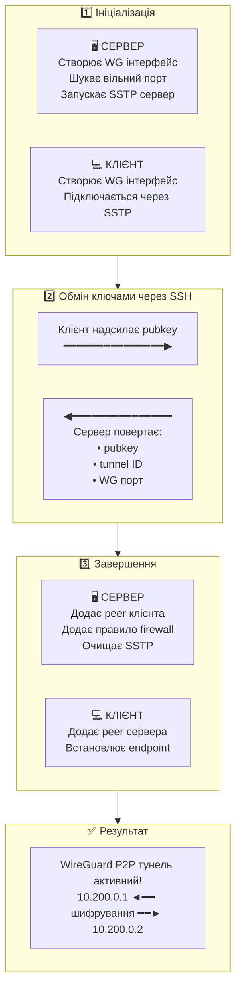

# k2o-wg-p2p-connector

[](README.md)

Автоматизоване створення WireGuard P2P тунелю між двома MikroTik RouterOS пристроями.

## Огляд

Цей скрипт автоматизує створення WireGuard point-to-point тунелю між двома MikroTik роутерами. Запустіть один і той же скрипт на обох пристроях — обмін ключами відбудеться автоматично через тимчасове SSTP з'єднання.

## Можливості

- **Один скрипт для обох сторін** — той самий файл запускається на обох роутерах
- **Автоматичне визначення ролі** — визначає server/client на основі IP адрес
- **Автоматичний обмін ключами** — без ручного копіювання публічних ключів
- **Виявлення конфліктів портів** — автоматичний пошук вільного порту
- **Унікальний ID тунелю** — кожен тунель отримує ідентифікатор на основі timestamp
- **Просте видалення** — автоматично згенерований скрипт для чистого видалення
- **Інтеграція з firewall** — автоматично відкриває порт WireGuard на сервері

## Швидкий старт

### 1. Завантажте та налаштуйте

Завантажте `wg-p2p-connector.rsc` та відредагуйте секцію конфігурації:

```routeros
# ═══════════════════════════════════════════════════════════════════
#  BASIC CONFIGURATION (required)
# ═══════════════════════════════════════════════════════════════════

:global p2pSide1Address "1.2.3.4"          # Публічний IP Side1 (сервер)
:global p2pSide2Address "5.6.7.8"          # Публічний IP Side2 (або пусто якщо за NAT)
:global p2pSstpPass "ChangeThisPassword!"  # Пароль для обміну ключами (однаковий)
```

**Визначення ролі:**
- Якщо обидва IP публічні → перший запущений стає сервером
- Якщо Side2 пустий або за NAT → Side1 сервер, Side2 клієнт

### 2. Завантажте на обидва роутери

Завантажте налаштований скрипт на обидва роутери.

### 3. Запустіть на Side1 (сервер) першим

```routeros
/import wg-p2p-connector.rsc
```

### 4. Запустіть на Side2 (клієнт) протягом 5 хвилин

```routeros
/import wg-p2p-connector.rsc
```

### 5. Готово! Перевірте з'єднання

```routeros
/ping 10.200.0.1   # з Side2
/ping 10.200.0.2   # з Side1
```

## Як це працює

<details>
<summary>📊 Показати діаграму</summary>



</details>

## Довідник конфігурації

### Базові (обов'язкові)

| Змінна | Опис | Приклад |
|--------|------|---------|
| `p2pSide1Address` | Публічний IP/FQDN Side1 | `"vpn.example.com"` |
| `p2pSide2Address` | Публічний IP Side2 (пусто якщо NAT) | `"5.6.7.8"` або `""` |
| `p2pSstpPass` | Пароль для обміну ключами | `"SecurePass123!"` |

### Основні (зі значеннями за замовчуванням)

| Змінна | За замовчуванням | Опис |
|--------|------------------|------|
| `p2pTunnelName` | `"tunnel1"` | Коротка назва тунелю |
| `p2pSide1WgIP` | `"10.200.0.1"` | WireGuard IP Side1 |
| `p2pSide2WgIP` | `"10.200.0.2"` | WireGuard IP Side2 |
| `p2pWgNetmask` | `"/30"` | Маска мережі |

### Розширені (опціональні)

| Змінна | За замовчуванням | Опис |
|--------|------------------|------|
| `p2pWgPort` | `51820` | UDP порт WireGuard (автоінкремент якщо зайнятий) |
| `p2pSstpPort` | `443` | TCP порт SSTP для обміну ключами |
| `p2pSstpUser` | `"p2p-k2o-exchange"` | SSTP ім'я користувача |
| `p2pTimeout` | `300` | Таймаут очікування (секунди) |

> **Примітка:** Якщо `p2pWgPort` вже використовується, сервер автоматично знаходить наступний вільний порт і передає його клієнту.

## Видалення

Для видалення тунелю запустіть на кожному роутері:

```routeros
/system script run remove-p2p-k2o-{ID}
```

**Захист від випадкового видалення:** Потрібно запустити скрипт **3 рази протягом 30 секунд** для підтвердження. Це запобігає випадковому видаленню тунелю.

```
==================================================
  REMOVAL CONFIRMATION REQUIRED
==================================================
  Tunnel ID: 20251209123456

  Run this script 2 more time(s)
  within 30 seconds to confirm removal.
==================================================
```

Назва скрипта видалення показується в кінці розгортання.

## Приклади маршрутизації

Скрипт створює лише point-to-point зв'язність. Для маршрутизації додаткових мереж див. [документацію MikroTik WireGuard](https://help.mikrotik.com/docs/display/ROS/WireGuard).

**Маршрутизувати LAN клієнта (192.168.88.0/24) через тунель (на сервері):**

```routeros
/ip route add dst-address=192.168.88.0/24 gateway=10.200.0.2
```

**Маршрутизувати весь трафік через тунель (на клієнті):**

```routeros
/ip route add dst-address=0.0.0.0/0 gateway=10.200.0.1 distance=10
```

## Ручний обмін ключами

Якщо автоматичний обмін не вдався, скрипт покаже інструкції для ручного копіювання ключів.

Для ручного режиму встановіть ці глобальні змінні на клієнті перед запуском finalize:

```routeros
:global p2pServerPubkey "SERVER_PUBLIC_KEY"
:global p2pServerTunnelID "TUNNEL_ID"
:global p2pServerPort 51821   # тільки якщо сервер використовує інший порт
/system script run p2p-k2o-finalize
```

## Вимоги

- MikroTik RouterOS 7.x з підтримкою WireGuard
- Side1 повинен мати публічний IP (або port forwarding для портів SSTP та WG)
- Side2 повинен мати доступ до Side1 на порту SSTP (443 за замовчуванням)

## Ліцензія

k2o Custom License — вільне використання, вказування авторства, без перепродажу — див. [LICENSE](LICENSE)

## Підтримати проект

Якщо це було корисно:

- **GitHub**: Поставте зірку репозиторію
- **PayPal**: [paypal.me/olekovin](https://paypal.me/olekovin)
- **Monobank**: `4441 1144 6258 5765`
- **Crypto**: Див. нижче

<details>
<summary>Криптовалютні донати</summary>

- **BTC**: `bc1qxxxxxxxxxxxxxxxxxxxxxxxxxxxxxx`
- **ETH**: `0xXXXXXXXXXXXXXXXXXXXXXXXXXXXXXXXXXXXXXXXX`
- **USDT (TRC20)**: `TXxxxxxxxxxxxxxxxxxxxxxxxxxxxxxxxxxxx`

</details>

---

Зроблено за допомогою ШІ [@olekovin](https://t.me/olekovin) | [k2o.cc](https://k2o.cc)
